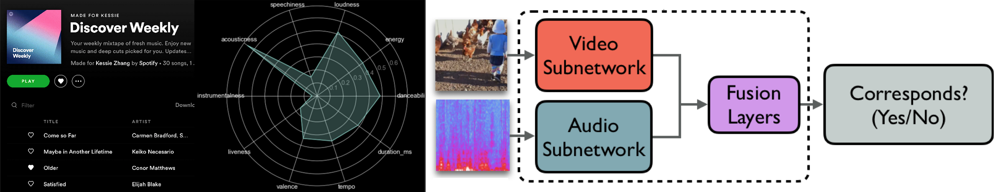
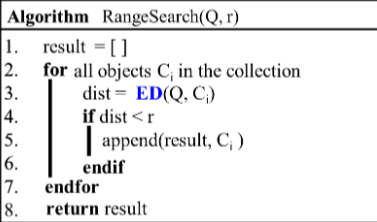
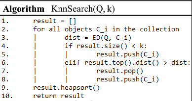
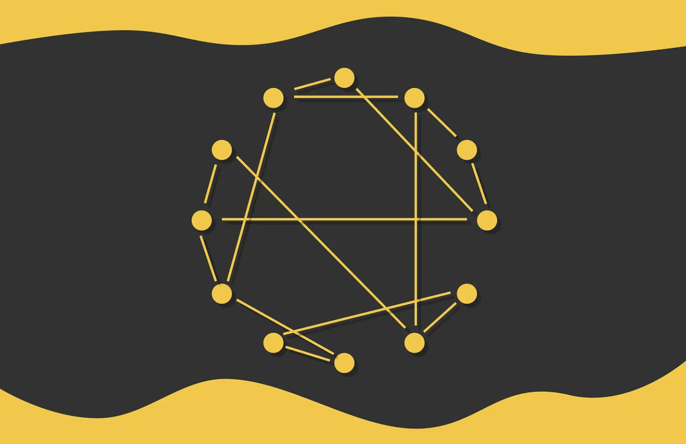
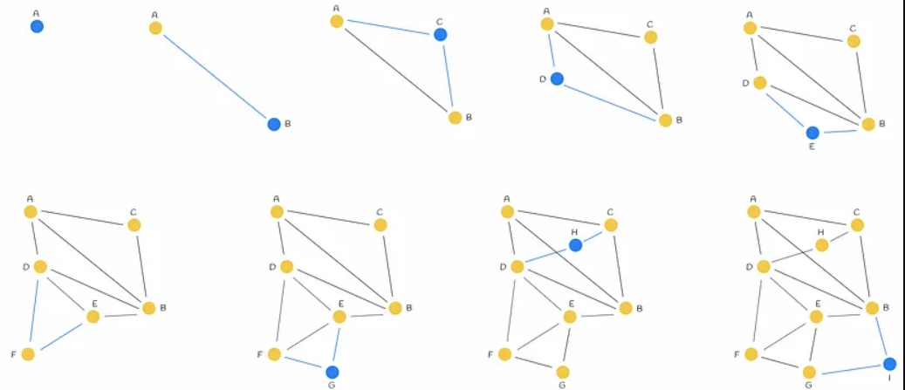
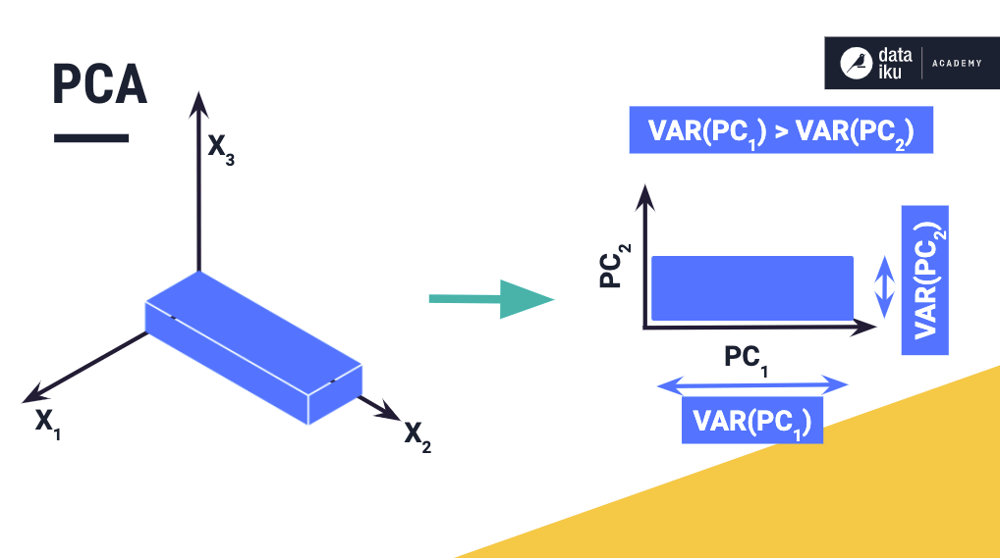

# Proyecto 3 - Bases de Datos 

Jean Pierre Sotomayor Cavero   100%

Angel Mucha Huaman             100%

Juan Torres                    100%

## Introducción
La exploración y extracción de información en documentos de texto involucra un proceso algorítmico fascinante y, en ciertos aspectos, intrincado. En la actualidad, se dispone de una amplia gama de técnicas y algoritmos diseñados para llevar a cabo búsquedas en archivos textuales, priorizando la precisión y la eficiencia. En este contexto, nos sumergiremos en la aplicación del método de indexación invertida para la búsqueda de textos en el conjunto de datos de ArXiv, una plataforma de distribución de archivos de código abierto.

## Objetivo
Este proyecto se centra en la óptima construcción de un índice invertido para facilitar tareas de búsqueda y recuperación en documentos de texto. Implicará el desarrollo de un sistema backend-frontend, utilizando código en Python para el backend y una interfaz gráfica de usuario (GUI) intuitiva como frontend. El objetivo primordial consistirá en comparar el rendimiento computacional de nuestra propia implementación del índice invertido con la de los sistemas de gestión de bases de datos PostgreSQL. La GUI resultante permitirá visualizar los resultados en los tres escenarios, y a partir de estos datos, se llevará a cabo un análisis de los tiempos de ejecución para evaluar la eficiencia de nuestro índice invertido.

### Descripción del dominio de datos
El conjunto de datos disponible en (https://www.kaggle.com/datasets/imuhammad/audio-features-and-lyrics-of-spotify-songs) contiene una amplia variedad de información sobre más de 18,000 canciones de Spotify, que incluye detalles como el artista, álbum, características de audio (por ejemplo, volumen), letras, el idioma de las letras, géneros y subgéneros.

Inicialmente, el conjunto de datos original fue utilizado en la tercera semana del proyecto TidyTuesday y solo comprendía características de audio y géneros. Para enriquecer la información, se agregaron las letras a través de la biblioteca Genius en R, y se incorporó el idioma de las letras utilizando la biblioteca langdetect en Python. Sin embargo, es importante tener en cuenta que aproximadamente solo la mitad de las canciones originales se encuentran disponibles en este conjunto de datos, ya que las letras no pudieron recuperarse para muchas de ellas.


### Descarga de canciones  
La descarga de canciones se llevó a cabo mediante el uso de dos bibliotecas fundamentales: ```Spotify``` y ```spotdl```.

- Spotify:  
  


Esta biblioteca se encargó de utilizar los datos disponibles en nuestro conjunto, específicamente, el nombre de la canción ```(track_name)``` y el artista ```(track_artist)```. A partir de esta información, se generó una URL directa a Spotify para la canción correspondiente. 
```python

def buscar(autor, song):
    autor = autor.upper()
    if len(autor) > 0:
        sp = spotipy.Spotify(client_credentials_manager=SpotifyClientCredentials(client_id, client_secret))
        query = f"{song} {autor}"  #trae la cancion exacta del artista
        result = sp.search(query, type='track', limit=1)  
        if result['tracks']['items']:
            track_uri = result['tracks']['items'][0]['external_urls']['spotify']
            return track_uri
        else:
            print("No se encontró la canción en Spotify.")
    else:
        print("El nombre del artista está vacío.")
```
Esta función utiliza la biblioteca Spotify para buscar la canción especificada por el nombre y el artista. Devuelve la URL directa de la canción en Spotify.

- Spotdl:  
    
La biblioteca ```spotdl``` fue utilizada para tomar la URL proporcionada por Spotify y realizar la descarga directa de la canción en nuestra máquina, asegurando así la disponibilidad local de las pistas musicales.

```python
def descargar(artista,name):
    spotify_track_url = buscar(artista,name)
    comando_spotdl = f"spotdl {spotify_track_url}"
    try:
        output = subprocess.check_output(comando_spotdl, shell=True, text=True)
        print(output)
    except subprocess.CalledProcessError as e:
        print("Error al descargar la pista:", e)
```  
Utiliza la URL de Spotify obtenida mediante la función ```buscar``` y emplea la biblioteca ```spotdl``` para descargar la canción en la máquina local.


### Extracción de características
Hay muchas formas de extraer caracteristicas de canciones, se pueden usar modelos que automaticamente te sacan un numero predefinido de caracteristicas como lo son la Api de Spotify y openL3.  


Sin embargo, para esta ocacion usaremos librosa, ya que nos permite extraer un conjunto muy alto de caracteristicas dependiendo de nuestras necesidades. Algo muy importante en este proyecto, ya que asi tendremos mejores busquedas.

  


#### MFCC (Coeficientes Cepstrales de Frecuencia Mel)  
Representa la forma en que el oído humano percibe diferentes frecuencias.  
Se calculan 20 coeficientes de MFCC a partir de la señal de audio, estos sirven para captura características fundamentales de la señal relacionadas con la percepción auditiva.  

```python
    mfccs = librosa.feature.mfcc(y=audio, sr=sr, n_mfcc=20)
    mfcc_features = np.concatenate((mfccs.mean(axis=1), mfccs.std(axis=1)))
```


#### Cromagrama  
Extrae la intensidad de los tonos musicasles a lo largo de la señal de audio.  

```python
        chroma = librosa.feature.chroma_stft(y=audio, sr=sr)
```


### Contraste Espectral  
Es una medida que destaca las regiones en una señal de audio que tienen una diferencia significativa en cuanto a energía espectral.  

```python
        contrast = librosa.feature.spectral_contrast(y=audio, sr=sr)
```


### Tonal Centroid Features  
Proporciona información sobre la estructura tonal y armónica de una pieza musical.
```python
            tonnetz = librosa.feature.tonnetz(y=audio, sr=sr)
```


### Tempo y Tempograma  
El tempo se refiere a la velocidad o ritmo de una composición musical.  
```python
        tempo, tempogram = librosa.beat.beat_track(y=audio, sr=sr)
```


### Algoritmos de búsqueda sin indexación 

La búsqueda secuencial se caracteriza por su simplicidad al calcular la similitud entre datos sin emplear indexación. Aunque su implementación es sencilla, conlleva una alta complejidad computacional al utilizar fuerza bruta. Este enfoque se utiliza en las búsquedas KNN y por rango, sirviéndose de esquemas específicos para optimizar la exploración de datos.
### KNN Range Search
Implica identificar todas las canciones dentro de un rango predefinido con respecto a una canción de consulta. En lugar de limitarse a un número específico de vecinos más cercanos, este enfoque permite recuperar un conjunto más amplio de canciones que comparten similitudes específicas con la canción de interés.  


### KNN con Cola de Prioridad  
Este metodo optimiza la búsqueda de canciones similares al utilizar una estructura de datos que prioriza las comparaciones más prometedoras. En lugar de examinar exhaustivamente todas las canciones, esta implementación se centra en las más relevantes, mejorando significativamente la eficiencia del algoritmo.  



### KNN-Secuencial  
El método de k-NN secuencial se basa en la búsqueda secuencial para encontrar las k canciones más cercanas a una consulta. Utiliza la distancia euclidiana entre características musicales para determinar la similitud y proporciona una solución sencilla pero efectiva para recuperar canciones similares en grandes conjuntos de datos musicales.     
```python
def knn_sequential(query, k):
    distances = []
    for sample in data_normalized:
        distance = euclidean_distances(query.reshape(1, -1), sample.reshape(1, -1))[0][0]
        distances.append(distance)
    
    indices = np.argsort(distances)[:k]#indices de manera ascendendete
    
    neighbors = []
    for index in indices:
        neighbors.append((nombres_id[index], distances[index]))
    
    return neighbors
```


### Faiss(HNSWFlat)  

La implementacion de HNSWFlat en la clase faiis, es un algoritmo de búsqueda de vecinos similares que se basa en la idea de crear una estructura jerárquica para organizar eficientemente los vectores característicos en un espacio métrico de alta dimensión. Funciona mediante la construcción de un grafo de conexión, donde cada nodo se conecta con un número fijo de vecinos cercanos, facilitando la exploración de regiones similares. La estructura jerárquica permite realizar búsquedas rápidas, ya que se pueden saltar entre niveles para reducir el espacio de búsqueda. El algoritmo consta de 3 partes importantes:   
- Al construir se establecen conexiones entre los nodos en cada capa del grafo. Cada nodo representa un vector característico del conjunto de datos, y las conexiones se establecen según la similitud métrica entre los vectores.
- Los nodos en capas superiores representan grupos más amplios, permitiendo una búsqueda más rápida en el espacio métrico al reducir el espacio de búsqueda antes de descender a capas inferiores para obtener detalles más específicos.  
 


  

Desventajas:  
- La desventaja mas notoria que se encontro, es que para un gran conjunto de datos la construccion de este indice tienen un consumo significativo de recursos, especialmente en términos de memoria. Mas que todo una limitacion para entornos limitados como por ejemplo maquinas virtuales.

### Experimento  
#### El problema de Rtree  
El árbol Rtree es una estructura dimensional que organiza sus elementos en ubicaciones geográficas según la dimensión especificada en el árbol. Aunque se recomienda aumentar la cantidad de dimensiones del árbol Rtree para separar elementos similares, surge un problema cuando la dimensión es demasiado grande. En este caso, si realizamos una búsqueda KNN en una dimensión, la distancia retornará un resultado, pero al hacer la misma consulta en un árbol de 2 dimensiones, la distancia se verá afectada y aumentará. Este problema persiste al aumentar las dimensiones, ya que el cálculo de distancias depende directamente de ellas. Esto contrasta con otros enfoques que pueden trabajar con un número significativo de dimensiones y redimensionarse sin problemas.  
Como el arbol Rtree no es optimo para tantas dimensiones, en el contexto de la inserccion de datos al arbol, se redimensionara la data a una dimension de 100.




Por lo tanto, a fines del experimento este se realizara bajo las mismas condiciones de data redimensionada para todos los algoritmos.  


### Resultados  
| N     | Seq   | Rtree | HighD |
| ----- | ----- | ----- | ----- |
| 1000  | 0.29 |  1| 0.000 |
| 2000  | 0.74 | 1 | 0.000 |
| 3000  | 1.05 | 1 | 0.002 |
| 4000  | 1.07 | 1 | 0.000 |
| 5000  | 1.73 | 1 | 0.01 |

### Conclusion y Analisis


