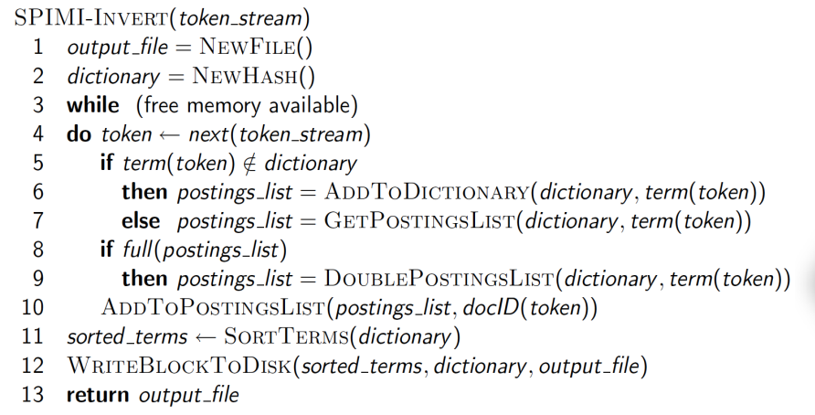
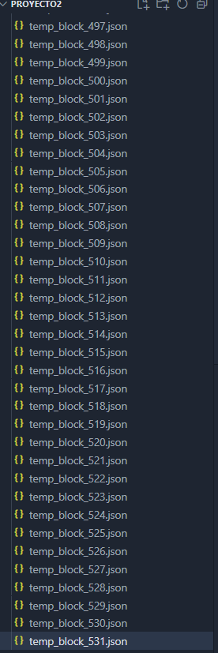
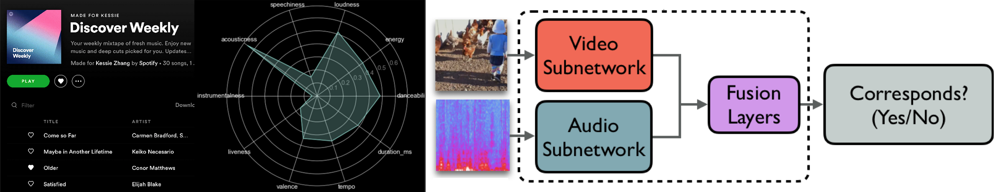
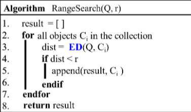
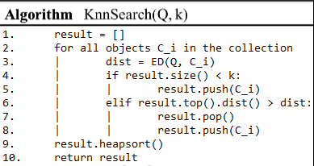
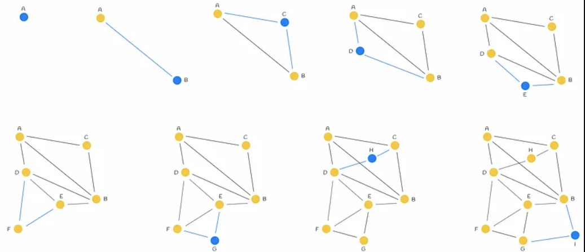
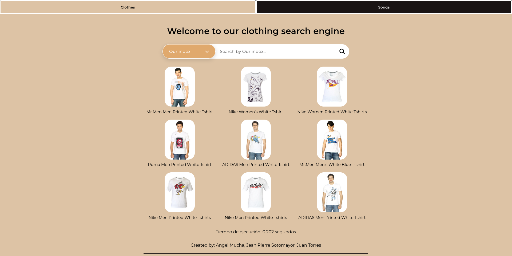
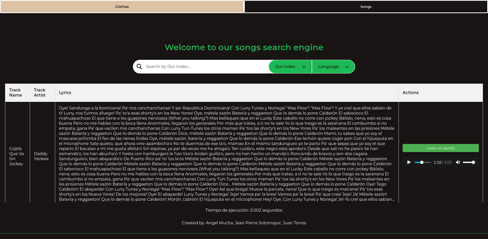
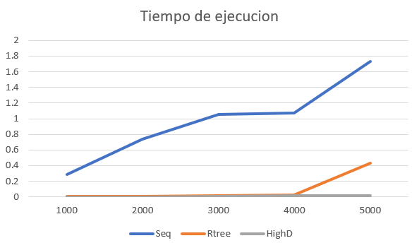

# Proyecto 3 - Bases de Datos 

## Organización del equipo

|            Participante             |   Papel   |
|:-----------------------------------:|:---------:|
|  Jean Pierre Sotomayor Cavero       |  Backend  |
|  Angel Mucha Huaman                 |  Backend  |
|  Juan Torres                        | Frontend  |

## Introducción
La exploración y extracción de información en documentos de texto involucra un proceso algorítmico fascinante y, en ciertos aspectos, intrincado. En la actualidad, se dispone de una amplia gama de técnicas y algoritmos diseñados para llevar a cabo búsquedas en archivos textuales, priorizando la precisión y la eficiencia. En este contexto, nos sumergiremos en la aplicación del método de indexación invertida para la búsqueda de textos en el conjunto de datos de ArXiv, una plataforma de distribución de archivos de código abierto.

## Objetivo
Este proyecto se centra en la óptima construcción de un índice invertido para facilitar tareas de búsqueda y recuperación en documentos de texto. Implicará el desarrollo de un sistema backend-frontend, utilizando código en Python para el backend y una interfaz gráfica de usuario (GUI) intuitiva como frontend. El objetivo primordial consistirá en comparar el rendimiento computacional de nuestra propia implementación del índice invertido con la de los sistemas de gestión de bases de datos PostgreSQL. La GUI resultante permitirá visualizar los resultados en los tres escenarios, y a partir de estos datos, se llevará a cabo un análisis de los tiempos de ejecución para evaluar la eficiencia de nuestro índice invertido.

## Descripción del dominio de datos
El conjunto de datos disponible en (https://www.kaggle.com/datasets/imuhammad/audio-features-and-lyrics-of-spotify-songs) contiene una amplia variedad de información sobre más de 18,000 canciones de Spotify, que incluye detalles como el artista, álbum, características de audio (por ejemplo, volumen), letras, el idioma de las letras, géneros y subgéneros.

Inicialmente, el conjunto de datos original fue utilizado en la tercera semana del proyecto TidyTuesday y solo comprendía características de audio y géneros. Para enriquecer la información, se agregaron las letras a través de la biblioteca Genius en R, y se incorporó el idioma de las letras utilizando la biblioteca langdetect en Python. Sin embargo, es importante tener en cuenta que aproximadamente solo la mitad de las canciones originales se encuentran disponibles en este conjunto de datos, ya que las letras no pudieron recuperarse para muchas de ellas.

## Backend
El backend fue construido utilizando el lenguaje de programación Python. Se crearon APIs y rutas específicas para cada método de indexación (en este caso, PostgreSQL y la implementación propia) basándose en la base de datos suministrada.
Para Postgresql usamos psycopg2 para hacer la conexion:

```python
def create_index_by_language(conn, idiomas_mapeados):
    cur = conn.cursor()
    cur.execute("ALTER TABLE song ADD COLUMN inverted_index tsvector;")
    cur.execute("SELECT track_id, track_name, track_artist, lyrics, language FROM song;")
    for row in cur.fetchall():
        track_id, track_name, track_artist, lyrics, language = row
        idioma_mapeado = idiomas_mapeados.get(language, 'english')
        print("Para el lenguaje: ",language)
        print("Se utilizo el stopword de: ", idioma_mapeado)
        cur.execute(sql.SQL("""
            UPDATE song
            SET inverted_index = setweight(to_tsvector(%s, COALESCE(%s, '')), 'A') ||
                                 setweight(to_tsvector(%s, COALESCE(%s, '')), 'B') ||
                                 setweight(to_tsvector(%s, COALESCE(%s, '')), 'C')
            WHERE track_id = %s;
        """), (idioma_mapeado, track_name, idioma_mapeado, track_artist, idioma_mapeado, lyrics, track_id))
    conn.commit()
    cur.close()
```

# Crear índice invertido según el idioma de cada fila

## Preprocesamiento
El preprocesamiento de la data se realizó en un código aparte, llamado ```tokenn.py```. Los procesos realizados fueron la tokenización del texto, el filtrado de las stopwords y caracteres especiales y la reducción de palabras con el método de stemming.

**tokenn.py**

#### Definición de Idiomas y Stopwords

- Define una lista de idiomas mapeados.
- Crea un diccionario llamado stopwords que almacena listas de stopwords para cada idioma (inglés, español, alemán, italiano y portugués).
- Lee archivos de stopwords para cada idioma y los almacena en el diccionario stopwords.

#### Stemming

- Recibe una lista de tokens como entrada y elimina los stopwords. También hace un proceso de stemming utilizando "SnowballStemmer" de NLTK para reducir las palabras a su forma raíz. Devuelve una lista de tokens procesados.

#### Limpieza y Tokenización del Texto:

`clean_and_tokenize`: Es una función que realiza la limpieza y tokenización del texto.
```python
def clean_and_tokenize(text):
    # Eliminar caracteres no alfanuméricos y convertir a minúsculas
    text = re.sub(r'[^a-zA-Z0-9]', ' ', text).lower()
    tokens = word_tokenize(text)
    return tokens

```
- Limpia el texto eliminando caracteres no alfanuméricos y convirtiéndolo a minúsculas.
- Utiliza la biblioteca NLTK para tokenizar el texto.

#### Procesamiento del Archivo CSV:

- Abre un archivo CSV llamado 'new_spotify.csv'.
- Itera sobre las filas del archivo y realiza las siguientes acciones para cada fila:
    ```python
    for row in csv_reader:

        # Obtener el ID de la fila
        row_id = row['track_id']
        idioma_track=row['language']

        if idioma_track in idiomas_mapeados:
            idioma=idioma_track
            stop= stopwords[idioma_track]
        else:
            idioma='en'
            stop=stopwords['en']
 
        # Concatenar los atributos textuales en una cadena
        atributos_textuales = [row[key] for key in row if key not in ['track_id','track_popularity', 'track_album_release_date','danceability','energy','key','loudness','mode','speechiness'
                                                                    ,'acousticness','instrumentalness','liveness','valence','tempo','duration_ms','track_album_id','playlist_id']]
        texto_completo = ' '.join(atributos_textuales)
        
        # Limpieza y tokenización del texto
        tokens = clean_and_tokenize(texto_completo)

        # Eliminar las stopwords
        tokens = [token for token in tokens if token.lower() not in stop]
        
        # Aplicar stemming a los tokens
        tokens = [stemmer.stem(token) for token in tokens]

        #ordenar los tokens
        tokens.sort()
        
        # Almacenar el ID de la fila y sus tokens en el diccionario
        data[idioma][row_id] = tokens
    ```

    - Obtiene el ID de la fila y el idioma de la pista.
    - Concatena los atributos textuales de la fila en una cadena.
    - Limpia y tokeniza el texto.
    - Elimina las stopwords del texto.
    - Aplica stemming a los tokens.
    - Almacena el ID de la fila y sus tokens en el diccionario data correspondiente al idioma.

#### Guardado en Formato JSON:
- Guarda los datos procesados en archivos JSON separados para cada idioma.
- Los archivos JSON se guardan con el nombre 'archivo_procesado.json' en carpetas separadas para cada idioma.
```python
for idioma,datos in data.items():
    nombre_archivo = os.path.join(idioma, 'archivo_procesado.json')
    with open(nombre_archivo, 'w') as json_file:
        json.dump(data[idioma], json_file, indent=4)
```

## Construcción del indice invertido

Para esta funcion usamos el algoritmo visto en clase para la creacion de indice invertido en memoria secundaria:

`spimi_invert_from_json` : Esta función toma un archivo JSON que contiene datos procesados de pistas de música y crea bloques temporales de un tamaño máximo determinado. Cada bloque contiene un índice invertido parcial, donde los términos están asociados con los documentos (ID de pista) en los que aparecen. Los bloques temporales se guardan en archivos JSON separados en un directorio temporal.
```python
def spimi_invert_from_json(json_file, output_directory, max_block_size):
    # Inicializar variables y estructuras de datos necesarias
    block = {}
    block_size = 0
    block_number = 0
    temporary_files = []
    print(json_file)

    with open(json_file, 'r') as json_data:
        data = json.load(json_data)
        
        for doc_id, doc_tokens in data.items():
            for token in doc_tokens:
                # Agregar el token al bloque actual
                if token not in block:
                    block[token] = []
                block[token].append(doc_id)

                # Verificar el tamaño del bloque
                block_size += 1

                if block_size >= max_block_size:
                    # Guardar el bloque actual en un archivo temporal
                    block_filename = os.path.join(output_directory, f'temp_block_{block_number}.json')
                    with open(block_filename, 'w') as block_file:
                        json.dump(block, block_file)
                    temporary_files.append(block_filename)

                    # Limpiar el bloque para el próximo conjunto de tokens
                    block = {}
                    block_size = 0
                    block_number += 1

    # Procesar el último bloque si no se alcanzó el tamaño máximo
    if block:
        block_filename = os.path.join(output_directory, f'temp_block_{block_number}.json')
        with open(block_filename, 'w') as block_file:
            json.dump(block, block_file)
        temporary_files.append(block_filename)

    return temporary_files
```
Parámetros:

- json_file (str): Ruta al archivo JSON que contiene los datos procesados.
- output_directory (str): Directorio donde se guardarán los bloques temporales.
- max_block_size (int): Tamaño máximo de los bloques temporales.

#### Bloques temporales despues de ejecutar `spimi_invert_from_json` con "Fashion" data



`Función merge_blocks`: Esta función fusiona los bloques temporales generados por spimi_invert_from_json para construir un índice invertido completo. Los términos en el índice invertido se ordenan alfabéticamente.

```python
def merge_blocks(temporary_directory, output_file):
    inverted_index = {}

    temporary_files = sorted(os.listdir(temporary_directory))

    for temp_file in temporary_files:
        temp_file_path = os.path.join(temporary_directory, temp_file)

        with open(temp_file_path, 'r') as temp_data:
            block_data = json.load(temp_data)

            # Fusionar los datos del bloque con el índice invertido
            for term, postings in block_data.items():
                if term not in inverted_index:
                    inverted_index[term] = []
                inverted_index[term].extend(postings)

    # Ordenar alfabéticamente los términos en el índice invertido
    sorted_inverted_index = {term: inverted_index[term] for term in sorted(inverted_index)}

    # Guardar el índice invertido completo en un archivo
    with open(output_file, 'w') as index_file:
        json.dump(sorted_inverted_index, index_file, indent=4)

    # Limpiar los archivos temporales
    for temp_file in temporary_files:
        temp_file_path = os.path.join(temporary_directory, temp_file)
        os.remove(temp_file_path)
```
Acciones:

- Fusiona los bloques temporales.
- Ordena alfabéticamente los términos en el índice invertido.
- Guarda el índice invertido completo en un archivo.
- Limpia los archivos temporales.

## Consulta/Búsqueda
Para realizar las consultas tenemos que tener guardado el tf/idf y la norma del documento que sera el document_lenght.
Todas estas funciones se encuentra en `calcular.py`.

#### Procedimiento:
- Carga del Índice Invertido:
    - Se carga el índice invertido preexistente desde el archivo JSON 'indice_invertido.json'.
- Carga de Datos de Documentos y Tokens:  
    - Se recopilan datos estructurados de documentos y sus correspondientes tokens desde el archivo JSON 'archivo_procesado.json'.
- Cálculo de TF-IDF y Longitudes de Documentos:  
    - Para cada documento, se calculan los pesos TF-IDF y las longitudes respectivas.
    - Los cálculos se realizan considerando el índice invertido previamente cargado.
- Almacenamiento de Resultados:
    - Los valores calculados de TF-IDF se guardan en el archivo JSON 'tfidf_data.json' con un formato estructurado y legible.
    - Las longitudes de los documentos se almacenan en el archivo JSON 'document_lengths.json', proporcionando una referencia rápida para futuros análisis.

```python
def calculate_tfidf(term, doc_tokens, inverted_index, total_docs):

    tf = calculate_tf(term, doc_tokens)
    idf = calculate_idf(term, inverted_index, total_docs)
    tfidf = tf * idf
    return tfidf

def calculate_document_length(doc_tokens, inverted_index, total_docs):

    squared_sum = 0
    for term in set(doc_tokens):
        tfidf = calculate_tfidf(term, doc_tokens, inverted_index, total_docs)
        squared_sum += tfidf**2
    doc_length = math.sqrt(squared_sum)
    return doc_length

for idioma in idiomas_mapeados:
    for doc_id, tokens in doc_tokens[idioma].items():
        #print(tokens)
        total_docs=len(doc_tokens[idioma])
        tfidf_values = {}#inicializar
        doc_length = calculate_document_length(tokens, inverted_index[idioma], total_docs)
        #                       print("Idioma: ",idioma," len ",total_docs)
        for term in set(tokens):
            tfidf = calculate_tfidf(term, tokens, inverted_index[idioma], total_docs)
            tfidf_values[term] = tfidf
        tfidf_data[idioma][doc_id] = tfidf_values
        document_lengths[idioma][doc_id] = doc_length
```
Para las consultas se ha implementado un motor de búsqueda eficiente que utiliza el esquema de similitud de coseno en combinación con TF-IDF. Este enfoque permite realizar consultas efectivas y recuperar documentos relevantes según la similitud de términos ponderados.
```python
def search(query, inverted_index, document_lengths, total_docs, tfidf_data, topk):
    topk = int(topk)
    query_tokens = query.split()

    query_tfidf = {term: calculate_tfidf(term, query_tokens, inverted_index, total_docs) for term in query_tokens}
    query_length = calculate_document_length(query_tokens, inverted_index, total_docs)

    # Obtener los documentos que contienen al menos uno de los términos de la consulta
    relevant_docs = set(doc_id for term in query_tfidf for doc_id in inverted_index.get(term, {}))

    cosine_scores = {}
    for doc_id in relevant_docs:
        score = sum(query_tfidf[term] * tfidf_data[doc_id].get(term, 0) for term in query_tfidf)
        score /= document_lengths[doc_id] * query_length
        cosine_scores[doc_id] = score

    # Ordenar los documentos por puntaje coseno y retornar los 10 mejores, no incluir si tiene el score 0
    results = [(doc_id, score) for doc_id, score in sorted(cosine_scores.items(), key=lambda x: x[1], reverse=True) if score > 0][:topk]

    return results
```
#### Proceso:
    - Tokenización y cálculo de pesos TF-IDF para la consulta.
    - Determinación de documentos relevantes.
    - Cálculo de puntajes de similitud de coseno entre consulta y documentos.
    - Ordenamiento descendente de documentos por puntaje.
    - Retorno de los 10 mejores documentos, excluyendo aquellos con puntaje 0.

## Descarga de canciones

La descarga de canciones se llevó a cabo mediante el uso de dos bibliotecas fundamentales: ```Spotify``` y ```spotdl```.

- Spotify:  
  


Esta biblioteca se encargó de utilizar los datos disponibles en nuestro conjunto, específicamente, el nombre de la canción ```(track_name)``` y el artista ```(track_artist)```. A partir de esta información, se generó una URL directa a Spotify para la canción correspondiente. 
```python
def buscar(autor, song):
    autor = autor.upper()
    if len(autor) > 0:
        sp = spotipy.Spotify(client_credentials_manager=SpotifyClientCredentials(client_id, client_secret))
        query = f"{song} {autor}"  #trae la cancion exacta del artista
        result = sp.search(query, type='track', limit=1)  
        if result['tracks']['items']:
            track_uri = result['tracks']['items'][0]['external_urls']['spotify']
            return track_uri
        else:
            print("No se encontró la canción en Spotify.")
    else:
        print("El nombre del artista está vacío.")
```
Esta función utiliza la biblioteca Spotify para buscar la canción especificada por el nombre y el artista. Devuelve la URL directa de la canción en Spotify.

- Spotdl:  

    

La biblioteca ```spotdl``` fue utilizada para tomar la URL proporcionada por Spotify y realizar la descarga directa de la canción en nuestra máquina, asegurando así la disponibilidad local de las pistas musicales.

```python
def descargar(artista,name):
    spotify_track_url = buscar(artista,name)
    comando_spotdl = f"spotdl {spotify_track_url}"
    try:
        output = subprocess.check_output(comando_spotdl, shell=True, text=True)
        print(output)
    except subprocess.CalledProcessError as e:
        print("Error al descargar la pista:", e)
```  
Utiliza la URL de Spotify obtenida mediante la función ```buscar``` y emplea la biblioteca ```spotdl``` para descargar la canción en la máquina local.

## Extracción de características
Hay muchas formas de extraer caracteristicas de canciones, se pueden usar modelos que automaticamente te sacan un numero predefinido de caracteristicas como lo son la Api de Spotify y openL3.  


Sin embargo, para esta ocacion usaremos librosa, ya que nos permite extraer un conjunto muy alto de caracteristicas dependiendo de nuestras necesidades. Algo muy importante en este proyecto, ya que asi tendremos mejores busquedas.   

  
#### MFCC (Coeficientes Cepstrales de Frecuencia Mel)  
Representa la forma en que el oído humano percibe diferentes frecuencias.  
Se calculan 20 coeficientes de MFCC a partir de la señal de audio, estos sirven para captura características fundamentales de la señal relacionadas con la percepción auditiva.  

```python
    mfccs = librosa.feature.mfcc(y=audio, sr=sr, n_mfcc=20)
    mfcc_features = np.concatenate((mfccs.mean(axis=1), mfccs.std(axis=1)))
```


#### Cromagrama  
Extrae la intensidad de los tonos musicasles a lo largo de la señal de audio.  

```python
        chroma = librosa.feature.chroma_stft(y=audio, sr=sr)
```


#### Contraste Espectral  
Es una medida que destaca las regiones en una señal de audio que tienen una diferencia significativa en cuanto a energía espectral.  

```python
        contrast = librosa.feature.spectral_contrast(y=audio, sr=sr)
```


#### Tonal Centroid Features  
Proporciona información sobre la estructura tonal y armónica de una pieza musical.
```python
            tonnetz = librosa.feature.tonnetz(y=audio, sr=sr)
```


#### Tempo y Tempograma  
El tempo se refiere a la velocidad o ritmo de una composición musical.  
```python
        tempo, tempogram = librosa.beat.beat_track(y=audio, sr=sr)
```
   
Definimos como maximo 1000 dimensiones, ya que segun un calculo del promedio es la cantidad mas acertada para todos.  
Concatenamos todas las caracteristicas previas y en caso de no llenar a 1000 lo relleno con 0, si se pasa simplemente la recorto. Este recorte se puede considerar "malo", sin embargo, como el recorte no sobrepasa ni el 10% de la dimension total entonces es valido para estos casos.

```python
    all_features = np.concatenate((
        mfcc_features,
        delta_mfcc_features,
        delta2_mfcc_features,
        chroma.mean(axis=1),
        contrast.mean(axis=1),
        tonnetz.mean(axis=1),
        tempogram
    ))

    # Validar que tenga 1000 siempre
    if len(all_features) < max_length:
        all_features = np.pad(all_features, (0, max_length - len(all_features)))
    else:
        # Recortar 
        all_features = all_features[:max_length]

    return all_features
```


Ya con todas estas caracteristicas simplemente deberemos recorrer las canciones ya descargadas y guardar sus caractersiticas en un archivo .pkl.  

```python
def save_features_to_pickle(folder_path, output_file):
    features = []
    for file_name in os.listdir(folder_path):
        if file_name.endswith(".mp3"):
            file_path = os.path.join(folder_path, file_name)
            song_features = extract_features(file_path)
            features.append(song_features)
    with open(output_file, 'wb') as file:
        pickle.dump(features, file)

folder_path = 'Musicas'
save_features_to_pickle(folder_path,'features.pkl')
```

## Algoritmos de búsqueda sin indexación 

La búsqueda secuencial se caracteriza por su simplicidad al calcular la similitud entre datos sin emplear indexación. Aunque su implementación es sencilla, conlleva una alta complejidad computacional al utilizar fuerza bruta. Este enfoque se utiliza en las búsquedas KNN y por rango, sirviéndose de esquemas específicos para optimizar la exploración de datos.

### KNN Range Search
Implica identificar todas las canciones dentro de un rango predefinido con respecto a una canción de consulta. En lugar de limitarse a un número específico de vecinos más cercanos, este enfoque permite recuperar un conjunto más amplio de canciones que comparten similitudes específicas con la canción de interés.  



### KNN con Cola de Prioridad  
Este metodo optimiza la búsqueda de canciones similares al utilizar una estructura de datos que prioriza las comparaciones más prometedoras. En lugar de examinar exhaustivamente todas las canciones, esta implementación se centra en las más relevantes, mejorando significativamente la eficiencia del algoritmo.  



### KNN-Secuencial  
El método de k-NN secuencial se basa en la búsqueda secuencial para encontrar las k canciones más cercanas a una consulta. Utiliza la distancia euclidiana entre características musicales para determinar la similitud y proporciona una solución sencilla pero efectiva para recuperar canciones similares en grandes conjuntos de datos musicales.     
```python
def knn_sequential(query, k):
    distances = []
    for sample in data_normalized:
        distance = euclidean_distances(query.reshape(1, -1), sample.reshape(1, -1))[0][0]
        distances.append(distance)
    
    indices = np.argsort(distances)[:k]#indices de manera ascendendete
    
    neighbors = []
    for index in indices:
        neighbors.append((nombres_id[index], distances[index]))
    
    return neighbors
```

### Rtree  
La implementación del R-Tree se lleva a cabo después de reducir la dimensionalidad de las matrices de datos mediante el análisis de componentes principales (PCA) a 100 dimensiones.

```python
from rtree import index
p = index.Property()
p.dimension = 100
p.buffering_capacity = 8
idx = index.Index(properties=p)

for i, sample in enumerate(matrices_reduced):
    idx.insert(i, sample)
    #print("insertando",i)

nearest_neighbors_indices = list(idx.nearest((matrices_reduced[3481]), 5)) # 5 vecinos más cercanos a la canción 3481
```
### Faiss(HNSWFlat)  

La implementacion de HNSWFlat en la clase faiis, es un algoritmo de búsqueda de vecinos similares que se basa en la idea de crear una estructura jerárquica para organizar eficientemente los vectores característicos en un espacio métrico de alta dimensión. Funciona mediante la construcción de un grafo de conexión, donde cada nodo se conecta con un número fijo de vecinos cercanos, facilitando la exploración de regiones similares. La estructura jerárquica permite realizar búsquedas rápidas, ya que se pueden saltar entre niveles para reducir el espacio de búsqueda. El algoritmo consta de 3 partes importantes:   
- Al construir se establecen conexiones entre los nodos en cada capa del grafo. Cada nodo representa un vector característico del conjunto de datos, y las conexiones se establecen según la similitud métrica entre los vectores.
- Los nodos en capas superiores representan grupos más amplios, permitiendo una búsqueda más rápida en el espacio métrico al reducir el espacio de búsqueda antes de descender a capas inferiores para obtener detalles más específicos.  
 


Se organiza los datos en capas jerárquicas de un espacio de características, facilitando la búsqueda eficiente de vecinos cercanos en espacios de alta dimensión.
  

#### Creacion del indice y funcion para la busqueda
En este caso, se establecen 32 vecinos para cada cancion, usamos distancia eulediana para sacar los "vecinos optimos" a los cuales unirse.  

```python
def train_index_HNSWFlat(data):
    # Inicializa el índice de FAISS con HNSW (Hierarchical Navigable Small World)
    M = 32  # Número de vecinos en la lista de entrada
    efConstruction = 100  # Explorar al construir canciones mientras mayor es mejor la precision y mas demora
    dimension = data_normalized.shape[1]   # Dimensión de tus características
    quantizer = faiss.IndexHNSWFlat(dimension, M, faiss.METRIC_L2) #Distancia eulediana
    quantizer.hnsw.efConstruction = efConstruction
    index = quantizer
    index.add(data)
    return index

def knn_faiss_HNSWFlat(indice, query_object, k):
    distances, indices = indice.search(np.expand_dims(query_object, axis=0), k)
    resultados = []
    for i in range(k):
        distancia = distances[0][i]
        etiqueta = nombres_id[indices[0][i]]
        resultados.append((distancia, etiqueta))
    return resultados

# Entrenamiento con IndexHNSWFlat
index_train = train_index_HNSWFlat(data_normalized)
```

Desventajas:  
- La desventaja mas notoria que se encontro, es que para un gran conjunto de datos la construccion de este indice tienen un consumo significativo de recursos, especialmente en términos de memoria. Mas que todo una limitacion para entornos limitados como por ejemplo maquinas virtuales.

## FrontEnd - Interfaz visual
Creamos una interfaz amigable al usuario que le permitirá realizar todo tipo de busquedas en  tanto la data relacionada a vestimenta, Fashion; y, sobre nuestra data de canciones, esto con tan solo un conjunto de palabras y un valor TopK a recuperar.

### Fashion Dataset


### Spotify Dataset


Observamos los datos más relevantes de las canciones a forma de tabla, y de un conjunto de opciones donde el usuario podrá redigirise a la página oficial de Spotify donde la canción se buscará de forma automática para que el usuario pueda interactuar con esta en su cuenta personal de Spotify. Además, también se carga una salida de audio para que el usuario pueda escuchar esta sin tener que salir de nuestra página.

## Experimento

#### El problema de Rtree  
El problema de Rtree se agrava cuando se enfrenta a conjuntos de datos de alta dimensionalidad, contribuyendo así a la maldición de la dimensionalidad. A medida que aumenta la cantidad de dimensiones en el árbol Rtree, el cálculo de distancias se ve afectado negativamente. Si bien se sugiere incrementar las dimensiones para separar elementos similares, la eficiencia de Rtree disminuye significativamente. Este fenómeno se alinea con la maldición de la dimensionalidad, donde el exceso de variables independientes en un conjunto de datos puede impactar la calidad y la interpretación de los modelos. En el caso específico de Rtree, redimensionar la data a una dimensión más manejable, como 100, se convierte en una estrategia para mitigar los problemas derivados de la alta dimensionalidad.


#### PCA
El PCA se utilizara para transformar toda la data a una dimension la cual el rtree pueda construirse y tener una eficiencia aceptable.  
Se extraen lo componentes principales, los cuales capturan a mayor varianza en los datos y con esto se logra una representación más compacta del conjunto de datos.

```python
n_dimensions = 100
# Crear un objeto PCA
pca = PCA(n_components=n_dimensions)
# Aplicar PCA a las matrices
matrices_reduced = pca.fit_transform(data_normalized)
```

Por lo tanto, a fines del experimento este se realizara bajo las mismas condiciones de data redimensionada para todos los algoritmos.  

## Analisis


### Resultados  
| N     | Seq   | Rtree | HighD |
| ----- | ----- | ----- | ----- |
| 1000  | 0.29 |  0.005 | 0.000 |
| 2000  | 0.74 | 0.006 | 0.000 |
| 3000  | 1.05 | 0.012 | 0.002 |
| 4000  | 1.07 | 0.022 | 0.000 |
| 5000  | 1.73 | 0.43 | 0.01 |

## Conclusion y Analisis

Este proyecto nos ha brindado la oportunidad de comprender diversas aproximaciones para llevar a cabo búsquedas en bases de datos, desde la creación de índices invertidos mediante SPIMI hasta la implementación de busqueda por similitud de canciones. Cada enfoque presenta sus propias ventajas y desventajas, y la selección dependerá de los requisitos específicos del proyecto, el tamaño del conjunto de datos y las funcionalidades necesarias. Resulta crucial evaluar las alternativas disponibles y considerar aspectos como el rendimiento, la escalabilidad y la flexibilidad para asegurar búsquedas eficientes y precisas en entornos de bases de datos.
